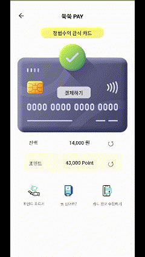
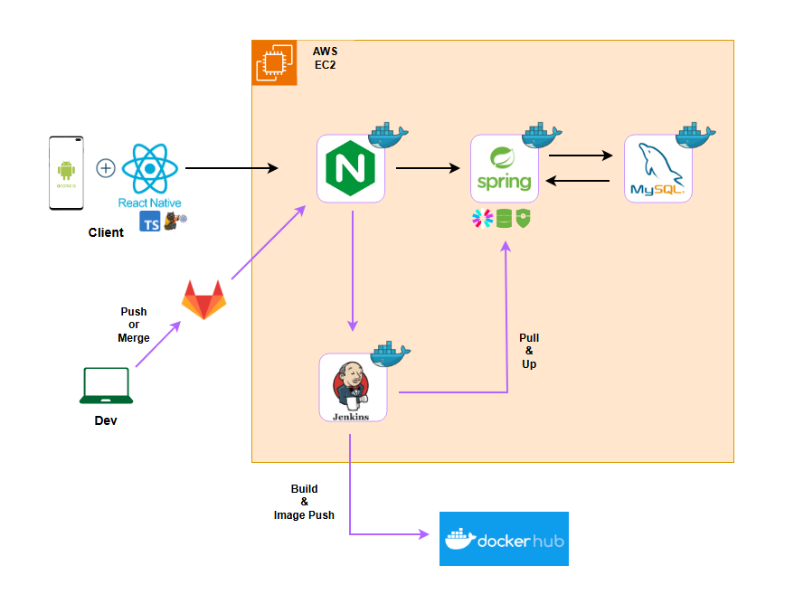

## 🥗우리아이 영양소 지킴이 쑥쑥(SSOOKSSOOK)🥗

## *"키도 쑥쑥, 자신감도 쑥쑥"*

## 목차
1. [기획 의도 및 기대 효과](#1-기획-의도-및-기대-효과)
2. [개발 환경](#2-개발-환경)
3. [주요 기능](#3-주요-기능)
4. [기술 소개](#4-기술-소개)
5. [설계 문서](#5-설계-문서)
6. [팀원 소개](#6-팀원-소개)

## 1. 기획 의도 및 기대 효과
- 아동급식카드의 정의와 목적
    - 아동급식카드는 저소득층 아동의 건강한 식사를 지원하는 복지 정책 수단입니다. 결식 우려 아동에게 지원금을 제공하여 균형 잡힌 영양 섭취를 돕습니다.
- 아동급식카드의 현황과 문제점
    - 아동급식카드는 외관이나 사용 방식으로 인해 주위에서 "결식아동"이라는 인식을 줄 수 있어, 아동에게 심리적 부담과 부끄러움을 유발합니다. 이는 가난을 낙인찍는 결과로 이어질 수 있습니다. → 아동의 자존감과 사회적 관계에 부정적인 영향을 미칠 수 있습니다. https://www.joongang.co.kr/article/25135063
    - 기존 카드와 아동급식카드를 번갈아 가며 결제해야 하는 상황이 발생해, 사용이 불편하고 비효율적입니다.
    - 현재 아동급식카드는 단순 결제 기능에 국한되어 있으며, 아이가 어떤 음식을 먹었는지 메뉴에 대한 정보가 없어 아이의 영양 관리또한 힘들다. https://www.pn.or.kr/news/articleView.html?idxno=20653
- 기능 간단 소개
    - **NFC 결제 결제** 
    - **포인트 분할 결제** 
    - **식사 영양소 자동 저장 & 주간 리포트**
- 기대 효과
    - **아동의 심리적 부담 완화 및 자존감 향상**
        NFC 기능을 도입하여 아동급식카드 사용 시 주변의 눈치를 볼 필요가 없어집니다. 이는 결식아동이라는 낙인을 줄이고 아동이 느끼는 부끄러움과 심리적 부담을 경감시켜 자존감과 사회적 관계에 긍정적인 영향을 미칠 것입니다.
    
    - **사용 편의성 및 효율성 증대**
        포인트 결제 및 분할 결제 시스템을 통해 기존 카드와 아동급식카드를 번갈아 사용하는 불편함이 해소됩니다. 이는 결제 과정을 간소화하여 아동과 보호자의 편의성을 높이고, 시간과 노력을 절약할 수 있습니다.
        
    - **아동 영양 관리 개선**
        메뉴 추천 및 주간 리포트 생성 기능을 통해 아동이 섭취하는 음식의 영양소를 추적하고 분석할 수 있습니다. 이를 통해 균형 잡힌 식단 제공이 가능해져 아동의 건강 증진과 올바른 식습관 형성에 도움을 줄 것입니다.
        
    - **정책 효과성 및 신뢰성 강화**
        이러한 개선을 통해 아동급식카드의 활용도가 높아지고, 정책의 목표 달성에 기여하게 됩니다. 이는 정부와 지자체의 복지 정책에 대한 신뢰성을 높이고, 향후 유사한 복지 프로그램 개발에도 긍정적인 영향을 미칠 것입니다.

## 2. 개발 환경
### Frontend
| Name | Version |
| --- | --- |
| Typescript | 5.0.4 |
| React | 18.3.1 |
| React Native | 0.76.1 |
| Zustand | 5.0.1 |
| NodeJs | 20.15.0 |

### Backend
| Name | Version |
| --- | --- |
| Java | 17 |
| Gradle | 8.10 |
| Spring Boot | 3.3.5 |
| JWT | 0.12.3 |
| Swagger(OpenAPI) | 2.1.0 |
| MySql | 8.0.32 |
| OpenAI | 4o |

## 3. 주요 기능

### 포인트 충전

### NFC 결제 시스템

### 주간 영양 리포트

### 가게 지도 및 메뉴 확인

## 4. 기능 및 기술 소개

1. **NFC 결제 시스템**
    - **NFC 기술 소개 및 장점**
        - NFC(Near Field Communication)는 근거리 무선 통신 기술로, 빠르고 간편하며 보안성이 높고 사용이 편리하여 다양한 결제 시스템에 활용되고 있습니다. 이번 프로젝트의 경우 PN532 모듈을 활용하여 스마트폰에 내장되어있는 NFC 태그를 인식하고 ESP32 컨트롤러를 활용하여 http통신으로 결제요청을 시도합니다.
    - **아동급식카드에 NFC 적용의 이점**
        - NFC 기술을 아동급식카드에 적용하면 결제 과정이 간소화되어 사용 편의성이 높아집니다. 또한 모든 NFC 지원 음식점에서 사용 가능해져 선택의 폭이 넓어지고, 결제 데이터 수집이 용이해집니다. 또한, 근거리에서만 작동하므로 무단 결제의 위험이 낮습니다.

2. **포인트 분할 결제**
    - **카카오페이 연동 방식**
        - 카카오페이 API를 활용하여 간편한 충전 기능을 구현합니다. 부모는 언제 어디서나 스마트폰으로 자녀의 포인트를 충전할 수 있습니다.
    - **포인트 관리 및 사용 내역 추적**
        - 실시간 포인트 잔액 확인, 사용 내역 조회, 월별 지출 리포트 등을 제공합니다. 이를 통해 부모와 아동 모두 효율적인 예산 관리가 가능해집니다.
    - **포인트 사용 방식**
        - 쑥쑥페이 포인트는 결제 시 자동으로 아동급식카드 1회 결제 한도를 먼저 소비하고 부족한 잔액큼 차감됩니다. 사용 가능한 가맹점에서 NFC 결제 단말기에 카드를 태그하면 즉시 결제가 이루어집니다.
        - 아동급식카드 1일 한도 금액을 초과할 시에는 포인트로만 결제가 이루어 집니다.
        - 또한, 사용 내역은 실시간으로 데이터베이스에 저장 및 영양소 분석이 이루어집니다.

3. **식사 영양소 자동 저장 & 주간 리포트**
    - **데이터 수집**
        - 부산 전지역 가게(약 45000)와 메뉴(약 350000개- 메뉴명, 메뉴설명, 메뉴 이미지)
        - 부산 전지역 학교 급식 데이터
        - 한국영양학회 - 한국인 영양소 섭취기준
    - **식사 기록 방법**
        - NFC로 결제한 메뉴의 정보(판매 가게의 정보, 메뉴명, 메뉴 설명, 메뉴 사진)와 EER계산을 바탕으로 한 음식양을 설정을 통해 OpenAi로 아이가 섭취한 영양소를  저장, 급식 데이터에 있는 영양소 또한 아이가 섭취한 영양소로 저장
            - EER(에너지요구량추정치) → Nutirtion and Health 저널의 한국인 에너지필요추정량 설정
            - 활동량 4단계 → 4단계 보다 더 세부적으로 단계를 나누는 방법들이 있지만 세부적인 단계들이 직관적이지 않고 정밀검사가 필요한 부분들이 있기에 직관적으로 선택할수 있는 4단계 활동성 선택 방식 채택
            - 한국인 신체활동단계별계수 (PA)
                - **비활동적**: 주로 앉아서 생활하며, 일상적인 신체활동이 거의 없는 경우입니다.
                - **저활동적**: 일상적인 활동 외에 가벼운 신체활동을 하는 경우입니다.
                - **활동적**: 일상생활 외에 규칙적으로 중간 정도의 신체활동을 하는 경우입니다.
                - **매우 활동적**: 일상생활 외에 강도 높은 신체활동이나 운동을 규칙적으로 하는 경우입니다.
    - **주간 리포트**
        - 아이의 신체정보 및 활동량을 기반으로 영양소 권장 섭취량( 한국영양학회 - 한국인 영양소 섭취기준 )을 계산
        - 헬스케어 애플리케이션 내부 데이터를 활용한 ChatGPT 건강 어드바이저(논문) -  “영양소 섭취량을 단순 수치가 아닌 자연어 기반의 데이터로 변환 후 응답을 요청할 경우 정확도를 크게 상승시킬 수 있었다.” -> 아이의 신체정보와 영양소 별로 개인화된 권장 섭취량을 구한후 4단계로 나눈후 아기가 섭취한 양을 자연어로 input값으로 전달
    
    - **단일 메뉴 추천**
        - 대한영양소협회, 식약청의 정보를 통해 청소년에게 좋은 음식들을 DB에 저장하고 아이가 섭취한 메뉴(최근 7일)와 급식들과의 단어 유사도를 비교해 낮은 순으로 5개 추천 → 아이가 다양한 음식을 접하도록

5. **가게 지도 및 메뉴 확인**
    - **카카오 맵 API 활용**
        - 카카오에서 제공하는 지도 API와 앞서 수집한 가게(경도, 위도 포함), 메뉴 데이터들을 활용해 지도 작성
        - 검색 알고리즘을 통해 음식점 혹은 메뉴명으로 검색 가능

## 5. 설계 문서
### 와이어 프레임 Mobile

### 시스템 아키텍쳐

### ERD

### 기능명세서

### API명세서

## 6. 팀원 소개

| **[최동호]()** | **[김동건]()** | **[윤동환]()** | **[정범수]()** | **[차봉석]()** |
|:---:|:---:|:---:|:---:|:---:|
|  |  |  |  |  | 
| Backend | Backend | Frontend | Frontend | Backend |

**Backend**
- 최동호 : 팀장 / 결제 시스템 / 카카오페이 / 실시간 알람 / PPT 제작 / 발표 
- 김동건 : 데이터 수집 및 전처리 / 인프라 구축 / 영양소 저장 및 메뉴추천, 주간 리포트 생성 서비스 구현
- 차봉석 : 회원 / 식당 / 급식 / 영양 관련 도메인

**Frontend**
- 정범수 : 프론트엔드 / 결제 시스템 / IoT / 프론트엔드 
- 윤동환 : 디자인 / 프론트엔드 / OCR 카드 등록 구현 / 카카오 API 연동 / 영양 점수 달력 / 랜딩, 메인, 영양 분석 리포트, 쑥 페이, 쑥 지도 페이지 제작